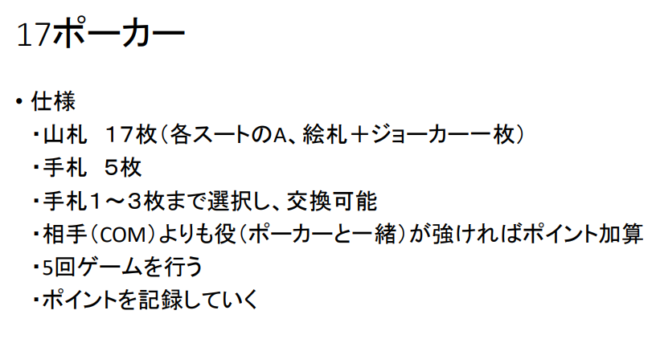
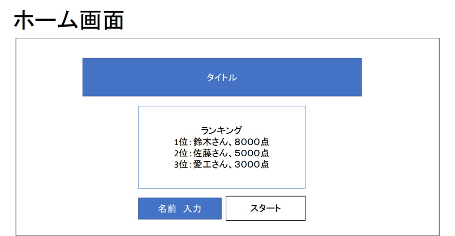
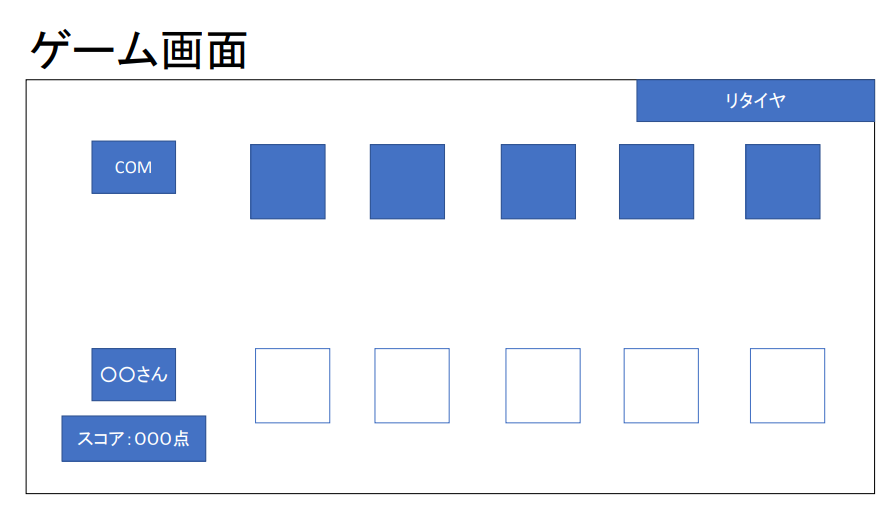
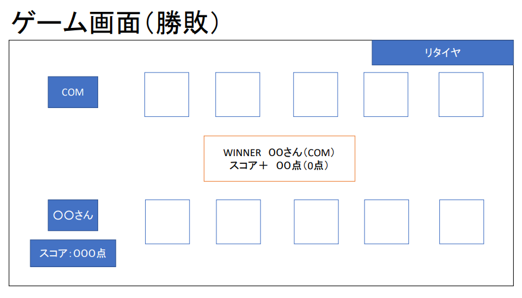
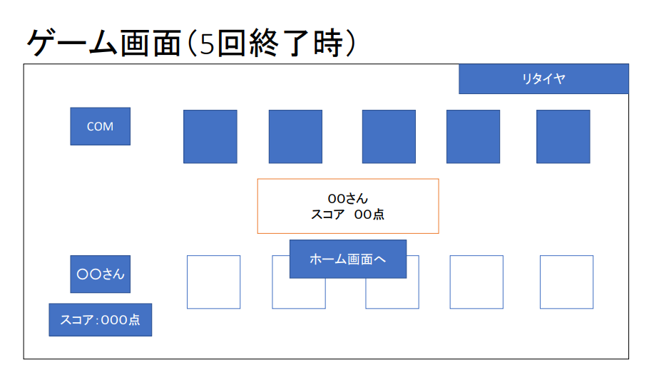

# オブジェクト指向プログラミングおよび演習 第12回進捗レポート

## 作成者
| 氏名           | 学籍番号    |
| -------------- | ----------- |
| 岩間　佑都　     | k19013　     |
| 外山　瑠起　     | k19074　     |
| 西澤　侑   | k19081　     |
| 馬場  健輔    | k19086　     |
| 堀田　富雅     | k19094　     |

## 仕様
- flaskを使ったゲーム

#追記：　交換しないボタン（勝負ボタン）の追加、次へボタンを追加

- css、画面を遷移できる（担当：堀田）
- Webとpythonでのスコアやハンドのやり取り（主担当：外山，副担当：岩間）
- python　17ポーカーで、ハンドを配る、交換する、判定してスコア返す（主担当：馬場，副担当：西澤）

- アプリ完成イメージ
    
    
    
    ＃追記　交換しない（勝負ボタン）
    
    ＃追記　次へ（次へボタン）
    
    

## 作業報告
### 12月10日
- Web―Python間でやり取りするデータについて話し合った（メンバー：岩間、外山、馬場、西澤）
詳細：

&emsp;&emsp;&emsp;1.Web側　スタートボタンのイベント　Python側　残り山札、COMの手札、プレイヤーの手札を返す

&emsp;&emsp;&emsp;2.Web側　プレイヤーの手札、COMの手札、交換するカードが何番目かを返す　Python側　プレイヤーの手札を返す、COMの手札を返す

&emsp;&emsp;&emsp;3.Web側　プレイヤーの手札、COMの手札を返す　Python側　勝敗、勝利側の得点を返す

&emsp;&emsp;&emsp;4.Web側　得点を合算、ゲーム終了後ランキングに乗る場合JSONを書き換え

- JSONファイルの作成（メンバー：外山）
    - マージ済み

- ポーカーのスクリプトを参考に17ポーカーを作成（メンバー：馬場、西澤）
    - マージ済み
    - 課題：Web.pyから与えられる引数や、返す値を考えたものに書き換えが必要

- ホーム画面の作成（メンバー：堀田）
    - マージ済み
    - 課題：ゲーム画面の作成、遷移

### 12月11日

- jsを用いたランキングの表示（ソートを含め）（メンバー：外山）
    - マージ済み

- カードの交換（class ChangeHand： receive_my_hand(self, プレイヤーの手札のリスト, 残り山札のリスト ,何枚目を交換するか,何枚目を交換するか(or None),何枚目を交換するか(or None)))（メンバー：馬場）
    - マージ済み
    - return [交換後のプレイヤーの手札]

- カードを配る（class TrumpGame： reset_draw_cards()）（メンバー：馬場）
    - マージ済み
    - return [プレイヤーの手札,COMの手札,残りの山札]

- プレイ画面の作成（メンバー：堀田）
    - 未マージ

- 役の評価（メンバー：西澤）
    - 未マージ

- カードを配るのリストが返って、それをWebに反映（メンバー：外山）
    - 未マージ

### 12月16日
- Poker.pyの添削（他スクリプトと被っている部分）（メンバー：岩間）
    - マージ済み
- カードを配るをWebに反映（メンバー：外山）
    - マージ済み
- 役の評価（class CompareHand： check_poker_hand(self, 手札のリスト))（メンバー：西澤）
    - マージ済み
    - return [役の点数]

### 12月17日
- カード選択のためのhtml、css、js（メンバー：堀田）
    - 未マージ
- 勝負ボタンを押した場合の処理をWebに反映（メンバー：外山）
    - 未マージ
    - 課題　スクレイピングではカードを配る処理が再びされて、正しいカードの情報が取得できないため、プレイヤーとCOMのカードの情報（合計10個）をパラメータで渡す方法で進める
- 役が同じだった時の評価（class CompareHand： check_high_number(self, 手札のリスト, 点数))（メンバー：西澤）
    - マージ済み
    - return [役の中で一番強いカードに対応した数字（強いカードは数字が小さい）]
    - 課題　スートでの評価はまだできない。

- カードを配る処理の微調整（メンバー：馬場）
    - マージ済み
    - 引数で渡す値を統一した

- ルール説明のhtml、css（メンバー：馬場）
    - 未マージ

### 12月18日
- カード選択のためのhtml、css、js（メンバー：堀田）
    - マージ済み

### 12月19日
- 役が同じだった時の評価（class CompareHand： judge_hand(self, player手札のリスト, com手札のリスト))（メンバー：西澤、岩間）
    - マージ済み
    - return [勝ち（プレイヤーかCOM）,得点]
    - キック＋スートも対応

### 12月21日
- 役の得点をWebに表示（メンバー：外山）
    - プルリク中
    - 大きなコンフリクトのため未マージ

### 12月23日
- 配るカードを整列、役評価の変数間違いの直し、カード交換の引数の微調整とCOMのカード交換の実現（カード交換　class ChangeHand:change_cards(self,playerの手札のリスト,COMの手札のリスト,playerが交換するn枚目,playerが交換するn枚目,playerが交換するn枚目)、COMのカードの交換は下記のメモをmemo）（メンバー：岩間、西澤、馬場）
    - プルリク中
    - return [交換済みのプレイヤーの手札,交換済みのCOMの手札]

## 振り返り（感想など）
- 

## memo
- 0 : Joker 
　1: (それぞれのマーク)A
　2: (それぞれのマーク)K
　3: (それぞれのマーク)Q
　4: (それぞれのマーク)J

- ファイブカード（800点）：4枚同じ数字＋Joker
- ロイヤルストレートフラッシュ（700点）：4枚違う数字＋すべて同じマーク＋Joker
- フォーカード（600点）：4枚同じ数字（3枚同じ数字＋Joker）
- フルハウス（500点）：2枚同じ数字＋3枚同じ数字（ツーペア＋Joker）
- ストレート（400点）：4枚違う数字＋Joker
- スリーカード（300点）：3枚同じ数字（ワンペア＋Joker）
- ツーペア（200点）：2枚同じ数字＋他2枚同じ数字
- ワンペア（100点）：2枚同じ数字

- 数字の小さい順に手札リストをソート（Joker（0）が含まれる場合、それ以外で役を評価する）

- キック　（役が同じな場合、役と関係ないカードで一番強いカードを持っているプレイヤーの勝ち（＋スートを含めて））

- COMの交換に関する思考ルーチン
    - ストレート（400点）以下の時に交換
    - ツーペアの場合　ユニークな残り1枚を交換
    - ワンペアの場合　ユニークな3枚の内、強いカード一枚（JokerがあればJoker）を残して交換
    - スリーカードの場合　ユニークな2枚すべてを交換

